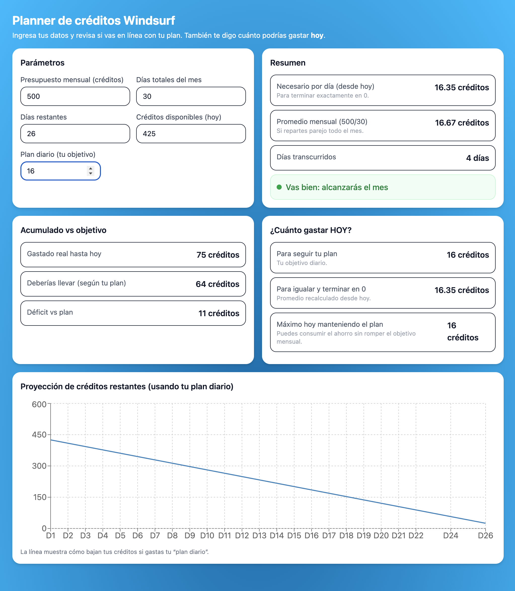

# Planner de Créditos Windsurf

Aplicación web simple desarrollada en **React + Vite + Tailwind + Recharts** para calcular y visualizar cómo administrar 500 créditos mensuales en Windsurf (o cualquier presupuesto similar). Permite ingresar parámetros y muestra métricas diarias, acumulados y una proyección gráfica.

## Características

- Cálculo automático del promedio de créditos por día.
- Comparación entre lo que deberías haber gastado y lo que realmente llevas.
- Indicador si vas en línea con tu plan o necesitas ajustar.
- Recomendaciones para cuánto gastar hoy:
  - Para seguir tu plan diario.
  - Para terminar exactamente en cero al final del mes.
  - Máximo posible manteniendo tu plan (usando ahorros acumulados).
- Gráfica interactiva con proyección de créditos restantes.

## Captura de pantalla




## Tecnologías utilizadas

- [React](https://react.dev/) con [Vite](https://vitejs.dev/)
- [TailwindCSS](https://tailwindcss.com/) para estilos
- [Recharts](https://recharts.org/) para la visualización gráfica

## Requisitos

- Node.js 18 o superior
- npm 9 o superior

## Instalación y uso

Clonar el repositorio e instalar dependencias:

```bash
npm install
```

Ejecutar en desarrollo:

```bash
npm run dev
```

Abrir en el navegador:

```
http://localhost:5173
```

Construir para producción:

```bash
npm run build
```

Previsualizar el build:

```bash
npm run preview
```

## Estructura principal

- `src/App.tsx` → Componente principal con lógica y UI.
- `src/index.css` → Incluye las directivas de Tailwind.
- `tailwind.config.js` → Configuración de Tailwind.

## Despliegue

Puedes desplegar el build (`/dist`) en:
- [Vercel](https://vercel.com/)
- [Netlify](https://www.netlify.com/)
- Cualquier servidor con Apache/Nginx
- Contenedor Docker con Nginx

## Próximas mejoras

- Guardar configuración en LocalStorage.
- Calcular automáticamente días restantes según la fecha actual.
- Modos especiales (fin de semana, ahorro flexible, etc.).